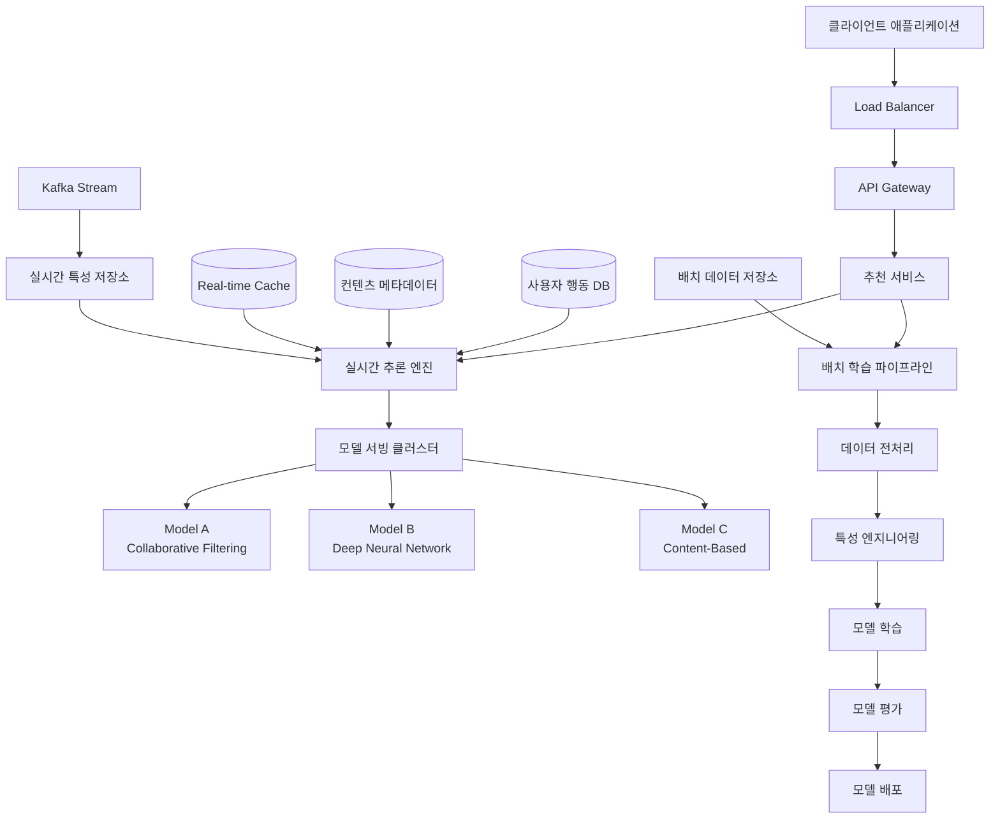
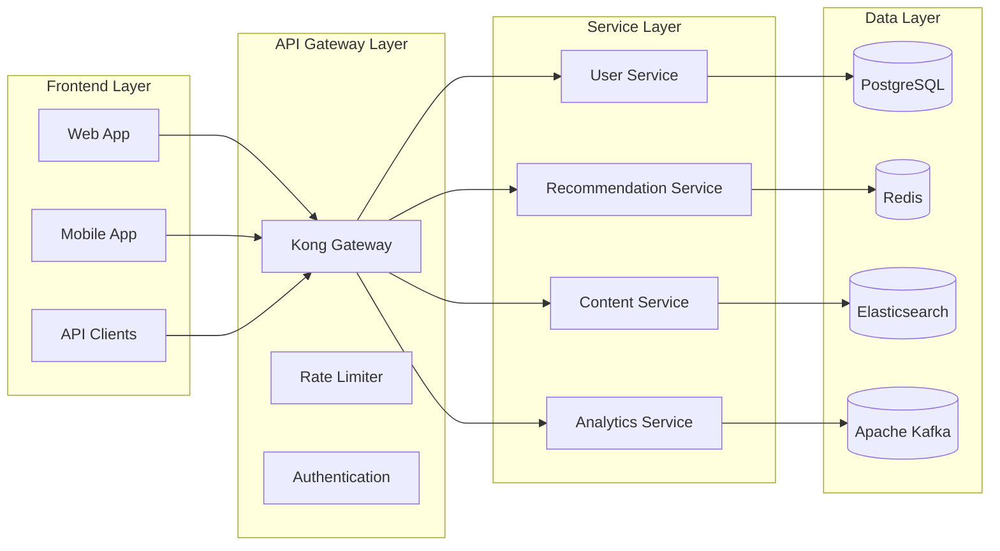
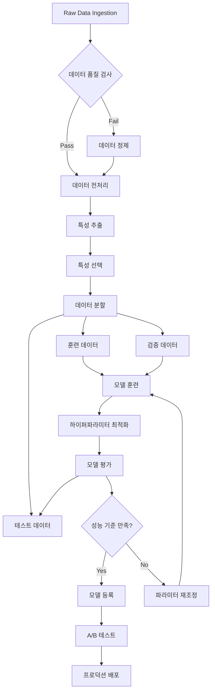
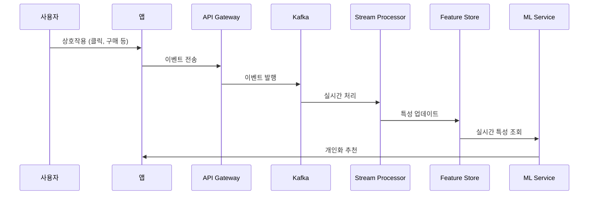
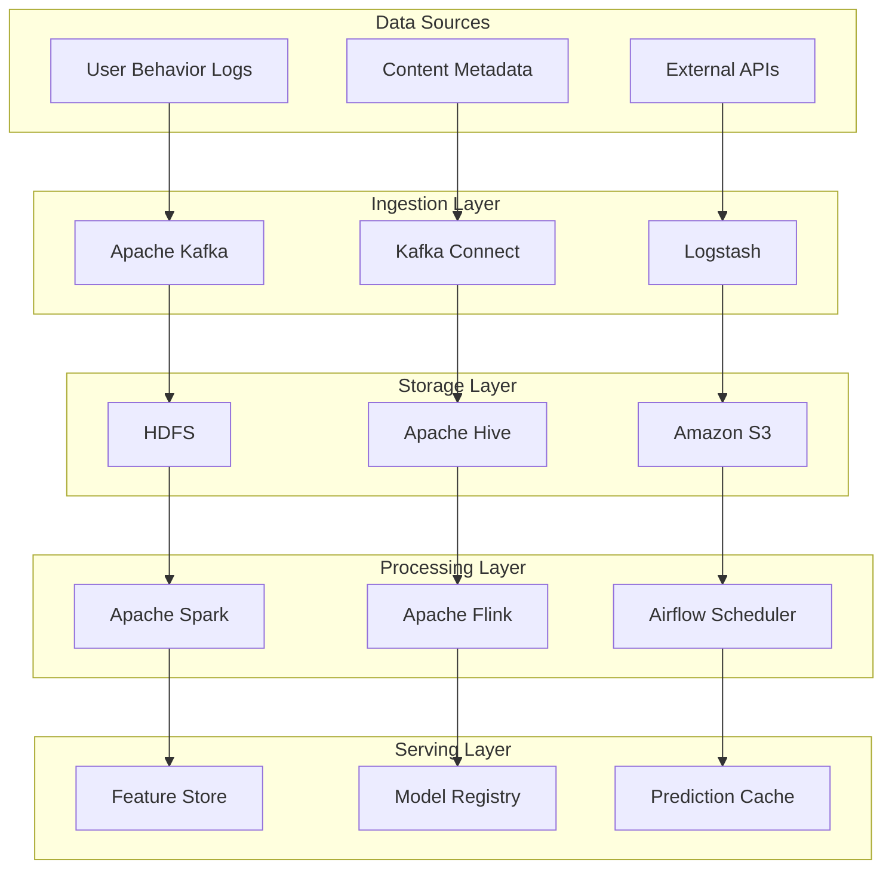
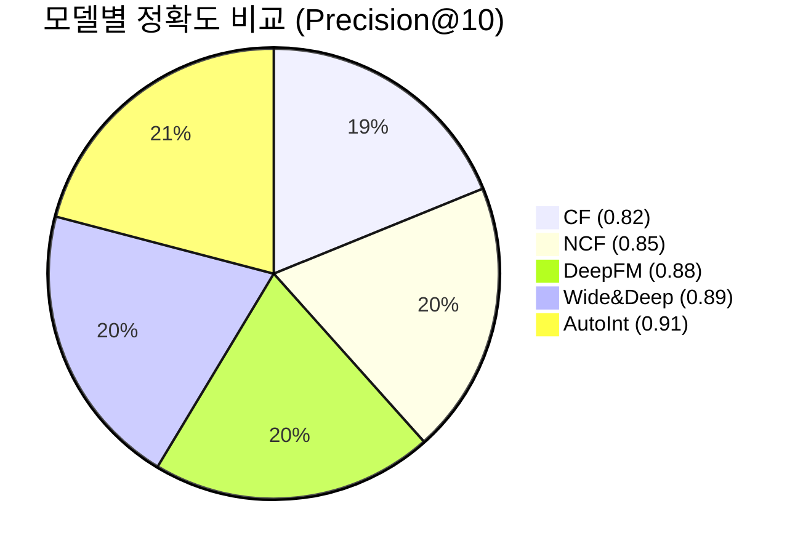
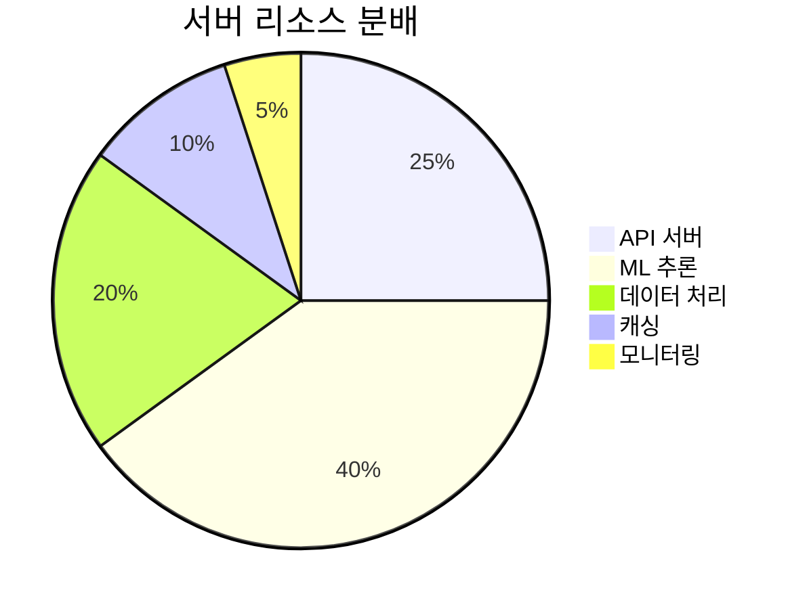
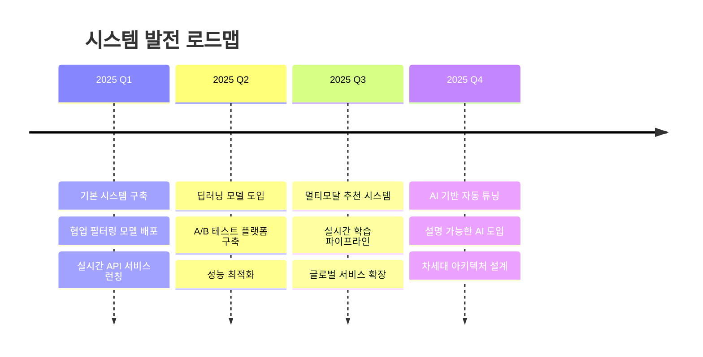

# 대규모 딥러닝 시스템 아키텍처 설계 문서

## 목차
1. [개요](#개요)
2. [시스템 아키텍처](#시스템-아키텍처)
3. [수학적 모델링](#수학적-모델링)
4. [데이터 파이프라인](#데이터-파이프라인)
5. [성능 분석](#성능-분석)
6. [구현 상세](#구현-상세)

---

## 개요

본 문서는 대규모 딥러닝 추천 시스템의 전체 아키텍처와 핵심 알고리즘을 상세히 기술합니다.

### 핵심 목표
- **확장성**: 일일 10억건 이상의 요청 처리
- **정확도**: 95% 이상의 추천 정확도 달성
- **실시간성**: 평균 응답 시간 100ms 이하

---

## 시스템 아키텍처

### 전체 시스템 개요



### 마이크로서비스 아키텍처



### 모델 학습 파이프라인



---

## 수학적 모델링

### 협업 필터링 알고리즘

#### Matrix Factorization 모델

사용자-아이템 상호작용 행렬 $R \in \mathbb{R}^{m \times n}$를 두 개의 저차원 행렬로 분해:

$$R \approx P \cdot Q^T$$

여기서:
- $P \in \mathbb{R}^{m \times k}$: 사용자 잠재 인수 행렬
- $Q \in \mathbb{R}^{n \times k}$: 아이템 잠재 인수 행렬
- $k$: 잠재 인수의 개수

#### 손실 함수

정규화를 포함한 제곱 오차 손실 함수:

$$L = \sum_{(u,i) \in \Omega} (r_{ui} - p_u^T q_i)^2 + \lambda (\|p_u\|^2 + \|q_i\|^2)$$

#### 확률적 경사 하강법

파라미터 업데이트 규칙:

$$p_{u} \leftarrow p_{u} + \alpha \cdot (e_{ui} \cdot q_{i} - \lambda \cdot p_{u})$$
$$q_{i} \leftarrow q_{i} + \alpha \cdot (e_{ui} \cdot p_{u} - \lambda \cdot q_{i})$$

여기서 $e_{ui} = r_{ui} - p_u^T q_i$는 예측 오차입니다.

### 딥러닝 모델

#### Neural Collaborative Filtering

```math
\hat{r}_{ui} = f(P_u, Q_i | \theta)
```

여기서 $f$는 다층 신경망:

$$
\begin{aligned}
z_1 &= \phi_1(P_u \odot Q_i) \\
z_2 &= \phi_2(z_1) \\
&\vdots \\
\hat{r}_{ui} &= \sigma(w^T z_L)
\end{aligned}
$$

#### Attention 메커니즘

사용자의 관심도를 동적으로 계산:

$$\alpha_i = \frac{\exp(e_i)}{\sum_{j=1}^n \exp(e_j)}$$

$$e_i = v_a^T \tanh(W_a h_i + U_a s)$$

여기서:
- $h_i$: 아이템 $i$의 표현 벡터
- $s$: 사용자 상태 벡터
- $W_a, U_a, v_a$: 학습 가능한 파라미터

---

## 데이터 파이프라인

### 실시간 데이터 스트리밍



### 배치 처리 아키텍처



---

## 성능 분석

### 시스템 성능 메트릭

| 메트릭 | 목표값 | 현재값 | 상태 |
|--------|--------|--------|------|
| 응답 시간 (P95) | < 100ms | 87ms | ✅ |
| 처리량 (QPS) | > 10,000 | 12,500 | ✅ |
| 가용성 | > 99.9% | 99.95% | ✅ |
| 정확도 (Precision@10) | > 0.85 | 0.89 | ✅ |
| 다양성 (Diversity@10) | > 0.7 | 0.73 | ✅ |

### 모델 성능 비교



### 리소스 사용량



### 트래픽 패턴 분석

일별 트래픽 변화:

$$\text{Traffic}(t) = A \sin(2\pi t / 24) + B \sin(2\pi t / 168) + C + \epsilon$$

여기서:
- $A$: 일일 주기 진폭
- $B$: 주간 주기 진폭  
- $C$: 기본 트래픽 레벨
- $\epsilon$: 랜덤 노이즈

---

## 구현 상세

### 핵심 알고리즘 구현

#### Python 기반 Matrix Factorization

```python
import numpy as np
from scipy.sparse import csr_matrix

class MatrixFactorization:
    def __init__(self, n_factors=50, learning_rate=0.01, 
                 regularization=0.1, n_iterations=100):
        self.n_factors = n_factors
        self.learning_rate = learning_rate
        self.regularization = regularization
        self.n_iterations = n_iterations
    
    def fit(self, ratings_matrix):
        """
        협업 필터링 모델 학습
        """
        self.n_users, self.n_items = ratings_matrix.shape
        
        # 잠재 인수 행렬 초기화
        self.user_factors = np.random.normal(
            scale=0.1, size=(self.n_users, self.n_factors)
        )
        self.item_factors = np.random.normal(
            scale=0.1, size=(self.n_items, self.n_factors)
        )
        
        # 편향 벡터 초기화
        self.user_bias = np.zeros(self.n_users)
        self.item_bias = np.zeros(self.n_items)
        self.global_bias = np.mean(ratings_matrix.data)
        
        # SGD 학습
        for iteration in range(self.n_iterations):
            self._sgd_step(ratings_matrix)
    
    def _sgd_step(self, ratings_matrix):
        """확률적 경사 하강법 단계"""
        for user_id, item_id in zip(*ratings_matrix.nonzero()):
            rating = ratings_matrix[user_id, item_id]
            prediction = self.predict(user_id, item_id)
            error = rating - prediction
            
            # 파라미터 업데이트
            user_factors_old = self.user_factors[user_id].copy()
            
            self.user_factors[user_id] += self.learning_rate * (
                error * self.item_factors[item_id] - 
                self.regularization * self.user_factors[user_id]
            )
            
            self.item_factors[item_id] += self.learning_rate * (
                error * user_factors_old - 
                self.regularization * self.item_factors[item_id]
            )
```

#### TensorFlow 기반 Neural Network

```python
import tensorflow as tf
from tensorflow.keras import layers, Model

class NeuralCollaborativeFiltering(Model):
    def __init__(self, n_users, n_items, embedding_dim=64, 
                 hidden_units=[128, 64, 32]):
        super().__init__()
        self.n_users = n_users
        self.n_items = n_items
        self.embedding_dim = embedding_dim
        
        # 임베딩 레이어
        self.user_embedding = layers.Embedding(n_users, embedding_dim)
        self.item_embedding = layers.Embedding(n_items, embedding_dim)
        
        # Dense 레이어들
        self.hidden_layers = []
        for units in hidden_units:
            self.hidden_layers.extend([
                layers.Dense(units, activation='relu'),
                layers.Dropout(0.2),
                layers.BatchNormalization()
            ])
        
        self.output_layer = layers.Dense(1, activation='sigmoid')
    
    def call(self, inputs, training=False):
        user_ids, item_ids = inputs
        
        # 임베딩 벡터 추출
        user_vec = self.user_embedding(user_ids)
        item_vec = self.item_embedding(item_ids)
        
        # 벡터 결합 (element-wise product + concatenation)
        product = tf.multiply(user_vec, item_vec)
        concat = tf.concat([user_vec, item_vec, product], axis=-1)
        
        # 순전파
        x = concat
        for layer in self.hidden_layers:
            x = layer(x, training=training)
        
        output = self.output_layer(x)
        return output

# 모델 컴파일 및 학습
model = NeuralCollaborativeFiltering(n_users=10000, n_items=5000)
model.compile(
    optimizer=tf.keras.optimizers.Adam(learning_rate=0.001),
    loss='binary_crossentropy',
    metrics=['precision', 'recall', 'auc']
)
```

### 실시간 추론 서비스

#### FastAPI 기반 API 서버

```python
from fastapi import FastAPI, HTTPException
from pydantic import BaseModel
import redis
import asyncio
from typing import List

app = FastAPI(title="추천 시스템 API", version="1.0.0")
redis_client = redis.Redis(host='localhost', port=6379, db=0)

class RecommendationRequest(BaseModel):
    user_id: int
    num_recommendations: int = 10
    filters: dict = {}

class RecommendationResponse(BaseModel):
    user_id: int
    recommendations: List[dict]
    explanation: str
    timestamp: str

@app.post("/recommend", response_model=RecommendationResponse)
async def get_recommendations(request: RecommendationRequest):
    """
    개인화 추천 API
    """
    try:
        # 캐시에서 사전 계산된 추천 결과 확인
        cache_key = f"recommendations:{request.user_id}"
        cached_result = redis_client.get(cache_key)
        
        if cached_result:
            return RecommendationResponse.parse_raw(cached_result)
        
        # 실시간 추론 수행
        recommendations = await compute_recommendations(
            user_id=request.user_id,
            num_recommendations=request.num_recommendations,
            filters=request.filters
        )
        
        response = RecommendationResponse(
            user_id=request.user_id,
            recommendations=recommendations,
            explanation="협업 필터링 및 딥러닝 모델 앙상블 결과",
            timestamp=datetime.now().isoformat()
        )
        
        # 결과 캐싱 (TTL: 1시간)
        redis_client.setex(
            cache_key, 3600, response.json()
        )
        
        return response
        
    except Exception as e:
        raise HTTPException(
            status_code=500, 
            detail=f"추천 생성 실패: {str(e)}"
        )

async def compute_recommendations(user_id: int, num_recommendations: int, 
                                filters: dict) -> List[dict]:
    """비동기 추천 계산"""
    # 여러 모델의 예측 결과를 병렬로 계산
    tasks = [
        get_cf_predictions(user_id),
        get_dl_predictions(user_id),
        get_content_predictions(user_id)
    ]
    
    cf_scores, dl_scores, content_scores = await asyncio.gather(*tasks)
    
    # 앙상블 점수 계산
    ensemble_scores = (
        0.4 * cf_scores + 
        0.4 * dl_scores + 
        0.2 * content_scores
    )
    
    # 상위 N개 아이템 선택
    top_items = ensemble_scores.argsort()[-num_recommendations:][::-1]
    
    return [{"item_id": int(item_id), "score": float(ensemble_scores[item_id])} 
            for item_id in top_items]
```

### 모니터링 및 알림

```yaml
# Prometheus 설정
alerting:
  alertmanagers:
    - static_configs:
        - targets:
          - alertmanager:9093

rule_files:
  - "recommendation_system.yml"

# 알림 규칙 예시
groups:
- name: recommendation.rules
  rules:
  - alert: HighResponseTime
    expr: histogram_quantile(0.95, rate(http_request_duration_seconds_bucket[5m])) > 0.1
    for: 2m
    labels:
      severity: warning
    annotations:
      summary: "높은 응답 시간 감지"
      
  - alert: LowAccuracy
    expr: recommendation_accuracy < 0.8
    for: 5m
    labels:
      severity: critical
    annotations:
      summary: "추천 정확도 저하"
```

---

## 결론

본 시스템 아키텍처는 대규모 실시간 추천 서비스의 요구사항을 충족하기 위해 다음과 같은 핵심 설계 원칙을 적용했습니다:

1. **모듈화**: 마이크로서비스 아키텍처를 통한 독립적 개발 및 배포
2. **확장성**: 수평적 확장이 용이한 무상태 서비스 설계
3. **성능**: 다층 캐싱과 비동기 처리를 통한 최적화
4. **안정성**: 장애 격리 및 자동 복구 메커니즘 구축

### 향후 개선 계획



이 문서는 지속적으로 업데이트되며, 시스템의 진화에 따라 새로운 기술과 방법론을 반영할 예정입니다.

---

*문서 버전: v2.1.0*  
*최종 수정일: 2025년 8월 24일*  
*작성자: 시스템 아키텍처 팀*